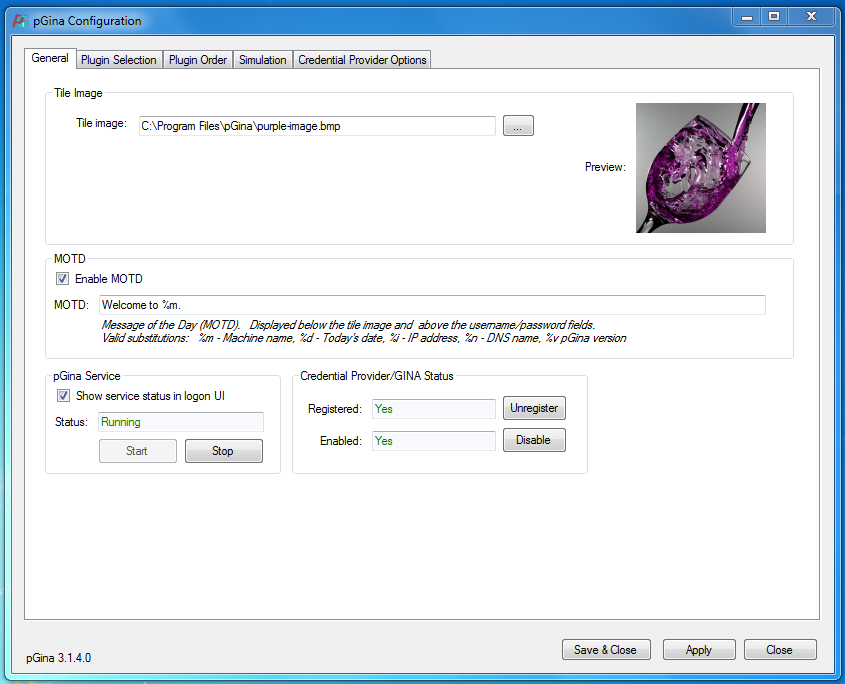
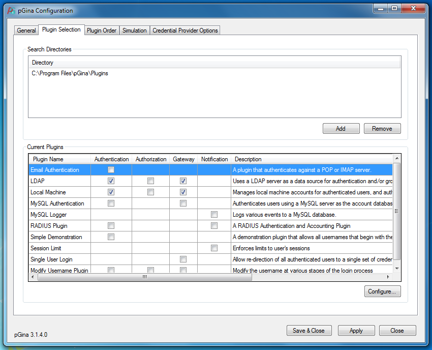
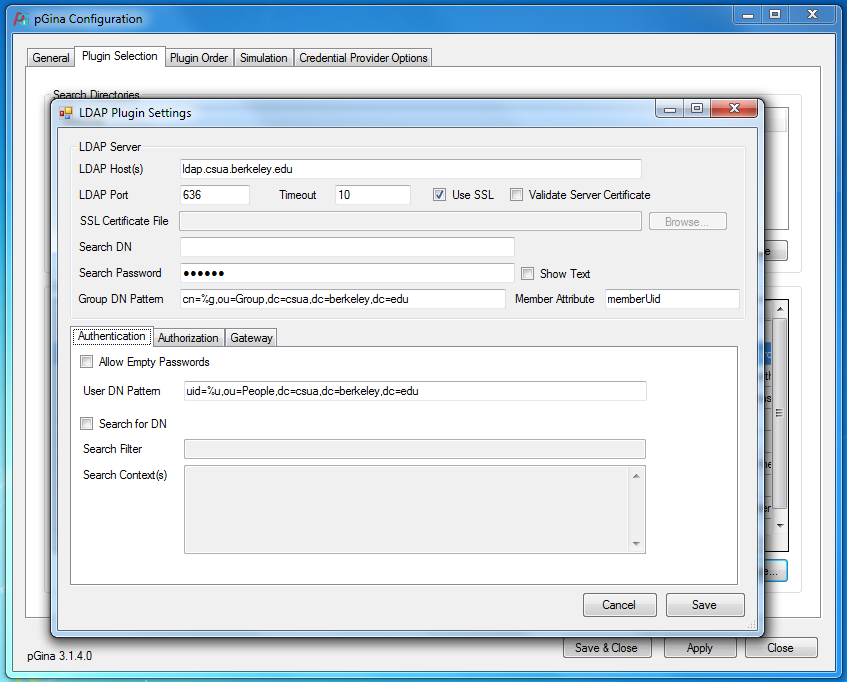
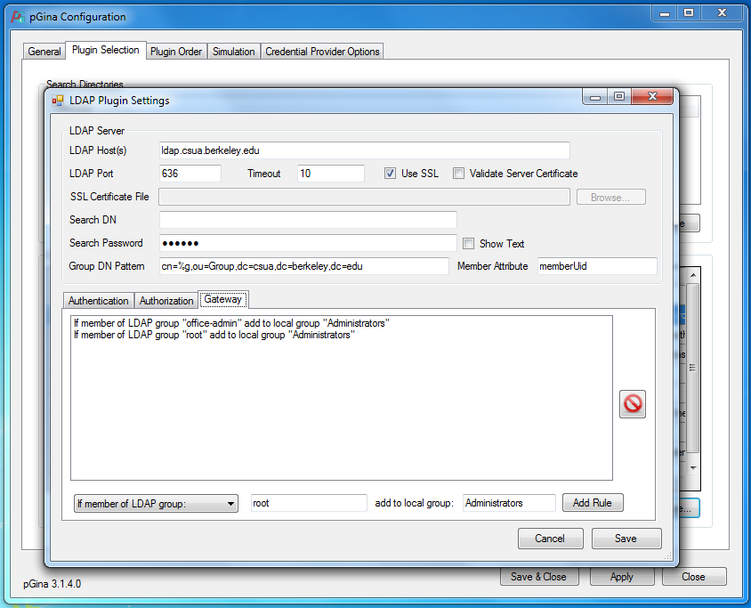
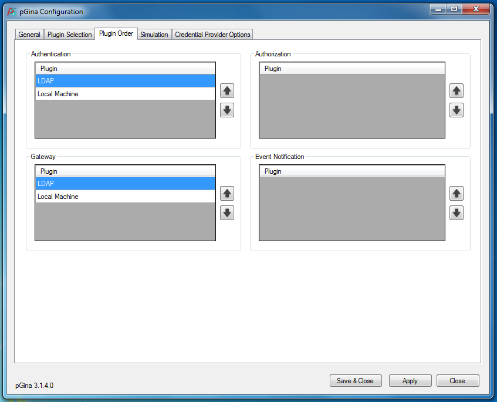

**Set up a new CSUA computer after a clean install of Windows**

1.  pGina

    a.  Download and install pGina ([*http://pgina.org/download.html*](http://pgina.org/download.html))

    b.  Choose a Tile image that fits the computer’s name

    c.  Configure pGina to connect to CSUA’s ldap server as shown in the photos

    d.  

    e.  The content for the hidden dots can be found in the secrets file on the Google drive.

    f.  

    g.  

    h.  

2.  csua.berkeley.edu/computers

    a.  Download client.pyw from the Tech VP google drive

    b.  Copy to C:\\ProgramData\\Microsoft\\Windows\\Start Menu\\Programs\\StartUp

    c.  Download and install python 2

3.  Install additional programs

    a.  Google Chrome

    b.  WinDirStat

    c.  HWMonitor

    d.  PuTTY

    e.  Sublime Text

    f.  JDK

4.  Check that computer can still dual-boot into Ubuntu

5.  NOTE:

    a.  To get Win10 anniversary update, enable insider preview builds

        i.  to force update, download and install

        ii. if it gets stuck at 44% do internet things

            1.  ok to power off

            2.  make sure windows defender, real time protection is dead

    b.  Make sure the computer is correctly named after a drink

